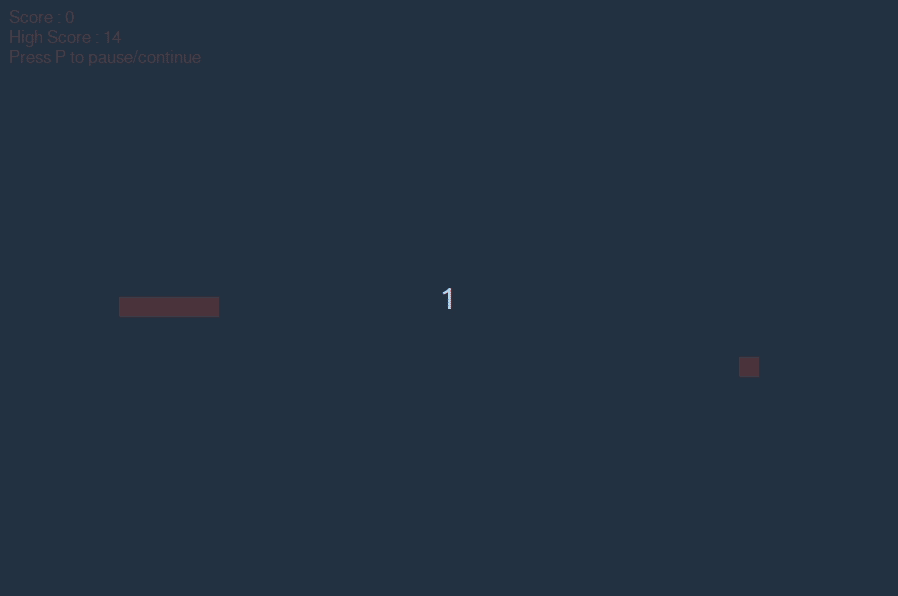

# Snake Game

This is a basic python implementation for the snake game.



### Getting started

##### Clone the repo

```
$ git clone https://github.com/Iheb-Haboubi/snake.git
$ cd snake
```

##### Install pygame

```
$ pip install pygame
```

for python3.8 or higher:

```
$ pip install pygame==2.0.0.dev10
```


##### Start the game

```
$ cd src/
$ python game.py
```
